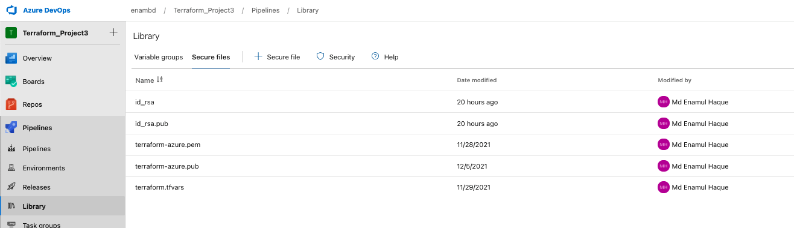
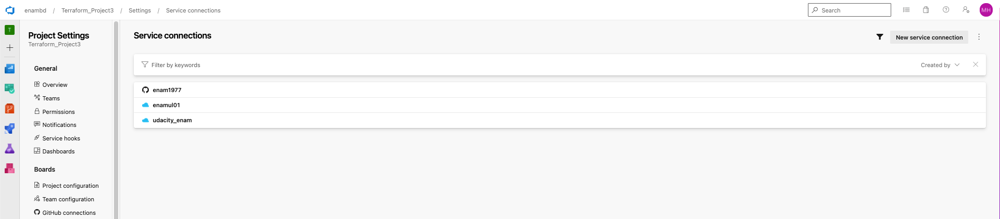
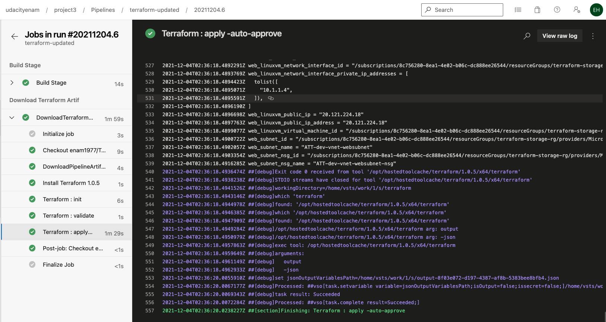
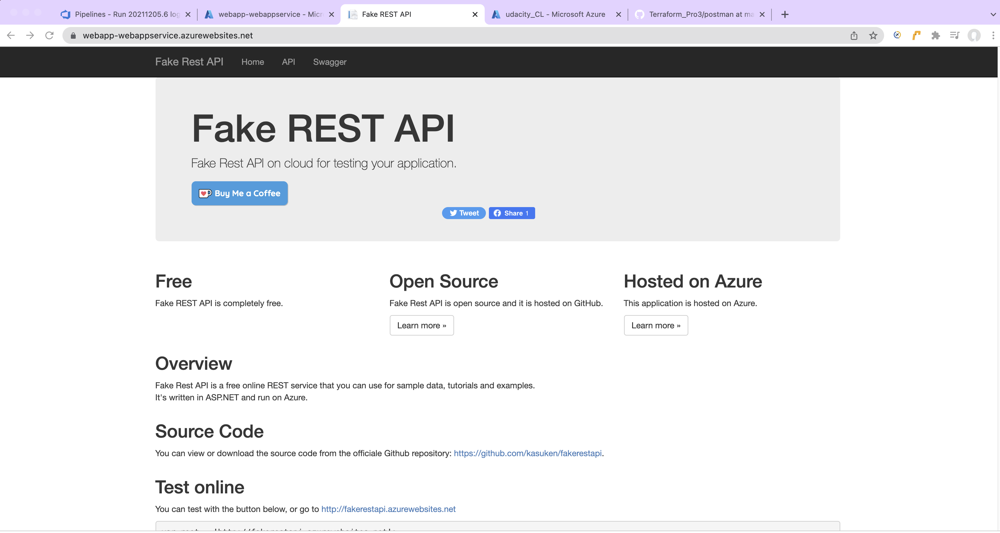
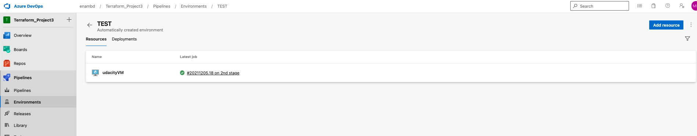
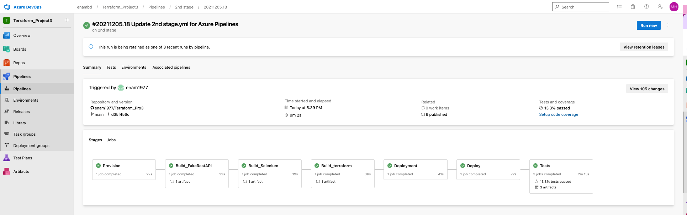
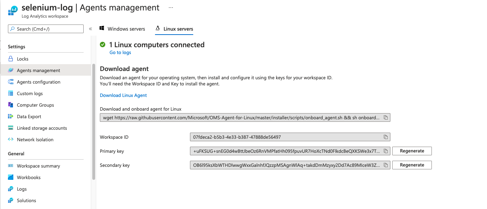
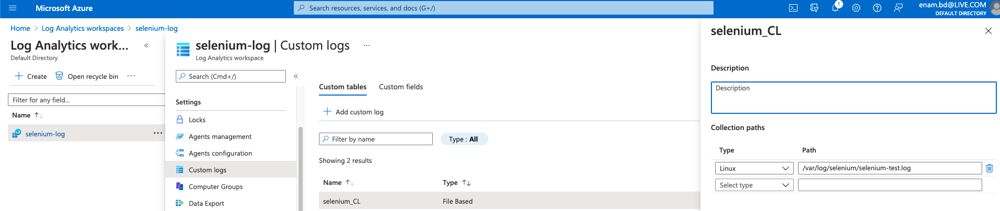
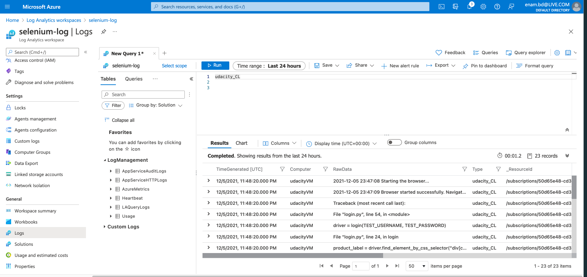

# Title: Project 3-Ensuring Quality Releases

## Pre-requisites:

Create Azure account https://azure.microsoft.com/en-us/free/ From above link you can create a azure account for the project to create your resources.

Homebrew is the place where all packages can be found to install(https://brew.sh/)

* Install Packe
* Install Terraform CLI
* Install CLI
* Install Azure CLI
* Install VS Code Editor
* Install HashiCorp Terraform plugin for VS Code
* Install Git Client
* Install Postman
* Install Selenium and webdrive
* Install Jmeter

## Installation procedures:

###### Install Brew
* First you need to install Homebrew, a powerful package manager for Mac. You can install following below command.

      /bin/bash -c "$(curl -fsSL https://raw.githubusercontent.com/Homebrew/install/HEAD/install.sh)"

###### Install XCode
* brew update xcode-select --install The reason to install xcode is that some software packages, usually open-source Unix packages, come with source code instead of a prebuilt binary file to install.

###### Install Python 3:
* $ brew install python AZ CLI does not work without Python 3 install into the system.

###### Selenium
* Download the latest Chrome driver.
* pip install -U selenium
* sudo apt-get install -y chromium-browser
* IMPORTANT You will need to add the chromedriver to PATH.
* In the Project Starter Resources folder, in the Selenium folder, execute the login.py file to open the demo site.

###### JMeter
Install JMeter.-https://jmeter.apache.org/download_jmeter.cgi
Use JMeter to open the Starter.jmx file in the “Project Starter Resources” JMeter folder.
Replace the APPSERVICEURL with the URL of your AppService once it's deployed.

Postman
Install Postman.-https://www.postman.com/downloads/
Import into Postman the starterAPIs.json collection from the Project Starter Resources.

AZ CLI Current Version (if installed)
az --version

Install Azure CLI (if not installed)
brew update brew install azure-cli

Upgrade az cli version
az --version brew upgrade azure-cli [or] az upgrade az --version

Install terraform from brew
brew install terraform

To confirm the installation, type terraform -v and you will get the current version as the output.

Terraform - Authenticating using the Azure CLI:

Azure Provider: Authenticating using the Azure CLI
Azure CLI Login
az login This command gets you to the azure portal where you have to provide credentials to get into the portal.

List Subscriptions
az account list This command get you the list of subscriptions associated with the account. In the list you will also get the subscription IDs.

Set Specific Subscription (if we have multiple subscriptions)
az account set --subscription="SUBSCRIPTION_ID" if you have more than one subscription IDs you need to set one to work for terraform. IF you have just one no need to do anything.

Install Git Client
Download Git Client
This is required when we are working with Terraform Modules

# Create Github Repository and Check-In Files

Create new github Repository
URL: github.com
Click on Create a new repository
Repository Name: any name you like
Description: Udacity project 3 
Repo Type: Public / Private
Initialize this repository with:
CHECK - Add a README file
CHECK - Add .gitignore
Select .gitignore Template: Terraform
Click on Create repository

Clone Github Repository to Local Desktop
# Clone Github Repo
git clone https://github.com/<YOUR_GITHUB_ID>/<YOUR_REPO>.git
git clone git@github.com:enam1977/Terraform_Pro3.git

Copy files from Git-Repo-Files folder to local repo & Check-In Code
Repo will be empty except README file. Now you can download the startup files from the udacity and paste it here to work on. after finishing the work you can push  the files to github to get into the azure pipeline to start executing the code. Follow the below command to push the chnages file.

Check-In code to Remote Repository
# GIT Status
git status

# Git Local Commit
git add .
git commit -am "First Commit"

# Push to Remote Repository
git push

# Verify the same on Remote Repository
git@github.com:enam1977/Terraform_Pro3.git

# Terraform in Azure
Configure the storage account and state backend. Replace the values below in terraform/environments/test/main.tf with the output from the Azure CLI:

storage_account_name
container_name
access_key

az group create -Name terraform-storage-rg -Location eastus

Create Azure Storage Account
- Create Resource Group by the command:  az group create -Name terraform-storage-rg -Location eastus

   Go to Resource Groups -> Add
   Resource Group: terraform-storage-rg
   Region: East US
   Click on Review + Create
   Click on Create

- Create Azure Storage Account
   Go to Storage Accounts -> Add
   Resource Group: terraform-storage-rg
   Storage Account Name: udacitystorage
   Region: East US
   Performance: Standard
   Redundancy: Geo-Redundant Storage (GRS)
   In Data Protection, check the option Enable versioning for blobs
   REST ALL leave to defaults
   Click on Review + Create
   Click on Create

- Create Container in Azure Storage Account
   Go to Storage Account -> udacitystorage -> Containers -> +Container
   Name: tfstatefiles
   Public Access Level: Private (no anonymous access)
   Click on Create

- Create service principle
   Below command create a service principle and get you credentials to use to run packer and terraform.
   az ad sp create-for-rbac -n "Uacity_P3" --role Contributor --query "{ client_id: appId, client_secret: password, tenant_id: tenant }"

```
   "client_id": "21331ae3-df85-4cc9-be3e-445508caa15c",
   "client_secret": "ceceabee-a05b-4155-b05c-4b6a28371b2f",
   "tenant_id": "dd152091-7e9a-448e-b6a0-223f687a2d84"
```
Find Subscription IDs
you will get above credentials by creating service principle but you also need subscription IDs that you can have using the following

   az account show --query "{ subscription_id: id }"

   Subscription_id: "50d65e48-cd36-43c6-b861-3b1bcc7804e9"

# Terraform in Azure

Use Terraform to create the following resources for a specific environment tier:
AppService

```
resource "azurerm_app_service_plan" "test" {
  name                = "${var.application_type}-${var.resource_type}-test"
  location            = var.location
  resource_group_name = data.azurerm_resource_group.rg.name

  sku {
    tier = "Free"
    size = "F1"
  }
}

resource "azurerm_app_service" "test" {
  name                = "${var.application_type}-${var.resource_type}-test"
  location            = var.location
  resource_group_name = data.azurerm_resource_group.rg.name
  app_service_plan_id = azurerm_app_service_plan.test.id

  app_settings = {
    "WEBSITE_RUN_FROM_PACKAGE" = 0
  }
}
```
Configure state backend.](https://docs.microsoft.com/en-us/azure/developer/terraform/store-state-in-azure-storage)
Earlier i have created resources group, stoage account name and container name. Need the name of those resources to configure state backend.


   
    terraform {
        backend "azurerm" {
            resource_group_name  = "${var.resource_group}"
            storage_account_name = "tstate12785"
            container_name       = "tstate"
            key                  = "terraform.tfstate"
        }
    }
   

# Create Virtual Network

```
resource "azurerm_virtual_network" "vnet" {
  name                = "${local.resource_name_prefix}-${var.vnet_name}"
  address_space       = var.vnet_address_space
  location            = var.resource_group_location
  resource_group_name = data.azurerm_resource_group.rg.name
  tags                = local.common_tags
}
```
# Network Security Group

```
resource "azurerm_linux_virtual_machine" "web_linuxvm" {
  name = "${local.resource_name_prefix}-web-linuxvm"
  #computer_name = "web-linux-vm"  # Hostname of the VM (Optional)
  resource_group_name = data.azurerm_resource_group.rg.name
  location            = var.resource_group_location
  size                = "Standard_DS1_v2"
  admin_username      = "azureuser"
 
  network_interface_ids = [azurerm_network_interface.web_linuxvm_nic.id]
  admin_ssh_key {
    username   = "azureuser"
    public_key = file("${path.module}/ssh-keys/terraform-azure.pub")
  }
  os_disk {
    caching              = "ReadWrite"
    storage_account_type = "Standard_LRS"
  }
  source_image_reference {
    publisher = "Canonical"
    offer     = "UbuntuServer"
    sku       = "18.04-LTS"
    version   = "latest"
  }

}

```
# Public IP

# Resource Group
  Resource Group has created earlier. Junt need to pull the date to use other resources to create.
 ```
    data "azurerm_resource_group" "rg" {
    name = var.resource_group_name
  ```
# Linux VM 

```
resource "azurerm_linux_virtual_machine" "web_linuxvm" {
  name = "${local.resource_name_prefix}-web-linuxvm"
  #computer_name = "web-linux-vm"  # Hostname of the VM (Optional)
  resource_group_name = data.azurerm_resource_group.rg.name
  location            = var.resource_group_location
  size                = "Standard_DS1_v2"
  admin_username      = "azureuser"
 
  network_interface_ids = [azurerm_network_interface.web_linuxvm_nic.id]
  admin_ssh_key {
    username   = "azureuser"
    public_key = file("${path.module}/ssh-keys/terraform-azure.pub")
  }
  os_disk {
    caching              = "ReadWrite"
    storage_account_type = "Standard_LRS"
  }
  source_image_reference {
    publisher = "Canonical"
    offer     = "UbuntuServer"
    sku       = "18.04-LTS"
    version   = "latest"
  }

}
```


## Create Azure DevOps Organization

# Create Azure DevOps Organization

   Understand about Azure DevOps Agents and Free-Tier Limits
   Navigate to https://dev.azure.com
   Click on Sign in to Azure DevOps
   Provide your Azure Cloud admin user
   Username: XXXXXXXXXXXXXX
   Password: XXXXXXXXXXXXXX
   Click on create New Organization
   Name your Azure DevOps organization: stacksimplify1
   We'll host your projects in: Choose the location (Azure selects based on current location where you are accessing from)
   Enter the characters you see:
   Click on Continue

# Request for Azure DevOps Parallelism

   Azure DevOps Parallelism Free Tier Request Form
   https://forms.office.com/pages/responsepage.aspx?id=v4j5cvGGr0GRqy180BHbR63mUWPlq7NEsFZhkyH8jChUMlM3QzdDMFZOMkVBWU5BWFM3SDI2QlRBSC4u

# Install Terraform Extension for Azure DevOps

   Terraform Extension for Azure DevOps
   https://marketplace.visualstudio.com/items?itemName=ms-devlabs.custom-terraform-tasks

# Create New Project in Azure DevOps Organization

   Click on New Project
   Project Name: terraform-pro3
   Description: Udacity project 3 azure pipeline
   Visibility: Private
   Click on Create

# Understand Azure Pipelines
   Understand about Azure Pipelines
   Pipeline Hierarchial Flow: Stages -> Stage -> Jobs -> Job -> Steps -> Task1, Task2

# Store credentials in azure pipeline
Due to security issue, upload the following information Azure DevOps Pipeline Library as a secure file

   id_rsa
   id_rsa_pub
   terraform.tfvars


https://github.com/enam1977/Terraform_Pro3/blob/main/screenshot/FAKE%20REST%20API_WEBAPP.png



#  Create a new Service Connection

 Go Project Settings >> Service connections >> New service connection >> Azure Resource Manager >> Next >> Service Principal (Automatic) >> Next >> Choose the correct subscription, and name such new service connection to Azure Resource Manager as azurerm-sc. This name will be used in azure-pipelines.yml.



# Create Azure CI (Continuous Integration) Pipeline (Build Pipeline)
Go to Azure DevOps -> Organization (enambd) -> Project (terraform_Project3) -> Pipelines -> Pipelines
Click on New Pipeline
Where is your code?: GitHub
Follow browser redirect steps to integrate with Github Account
Select a repository: enam1977/terraform-Pro3
Configure your pipeline: Starter Pipeline
Rename the Pipeline file name to whatever you like or keep as it is
Build the below code using tasks listed below that will check the authentication and create resources.


  trigger:
  branches:
    include:
      - main
  paths:
    exclude:
      - README.md
      - .gitignore
      - screenshots/

stages:
  - stage: Provision
    jobs:
      - job: provision_azure_infrastructure
        displayName: Provision Azure Infrastructure
        pool:
          vmImage: "ubuntu-18.04"
        steps:
          - task: DownloadSecureFile@1
            name: tfvardef
            displayName: Download terraform.tfvars
            inputs:
              secureFile: "terraform.tfvars"

            # Needed for Terraform VM deployment
          - task: InstallSSHKey@0
            inputs:
              knownHostsEntry: "known_hosts"
              sshPublicKey: $(PUBLIC_KEY)
              sshKeySecureFile: "id_rsa.pub"
          - task: DownloadSecureFile@1
            name: sshkey
            displayName: "Download SSH Public Key"
            inputs:
              secureFile: "id_rsa.pub"

          - task: DownloadSecureFile@1
            name: privatekey
            displayName: "Download SSH private Key"
            inputs:
              secureFile: "id_rsa"

          - task: Bash@3
            displayName: "Copy SSH key & Azure Principal"
            inputs:
              targetType: "inline"
              script: |
                mkdir -p ~/.ssh
                cp $(sshkey.secureFilePath) ~/.ssh
                cp $(privatekey.secureFilePath) ~/.ssh
                cp $(azureEnv.secureFilePath) $(System.DefaultWorkingDirectory)/terraform
                chmod 400 ~/.ssh/id_rsa.pub
                chmod 400 ~/.ssh/id_rsa
          

          - bash: |
              cp $(Agent.TempDirectory)/terraform.tfvars $(System.DefaultWorkingDirectory)/terraform/
            displayName: Copy terraform.tfvars
          - bash: |
              echo Pipeline workspace dir is $(Pipeline.Workspace)
              echo Terraform variable definition file is $(tfvardef.secureFilePath)
              cd $(Agent.TempDirectory)
              pwd
              ls -la
              cat terraform_azure.pub
              cd ~/.ssh/
              pwd
              ls -la
              cat known_hosts
              
              cd $(System.DefaultWorkingDirectory)  
              pwd
              ls -la
            displayName: Verify build environment (pre)
    - stage: Build_Selenium
    jobs:
      - job: build_artifacts_Selenium
        displayName: Artifacts_Selenium
        pool:
          vmImage: "ubuntu-18.04"
        steps:
          - task: ArchiveFiles@2
            displayName: Archive Selenium
            inputs:
              rootFolderOrFile: "$(System.DefaultWorkingDirectory)/selenium"
              includeRootFolder: false
              archiveType: "zip"
              archiveFile: "$(Build.ArtifactStagingDirectory)/selenium-$(Build.BuildId).zip"
              verbose: true

          - task: PublishPipelineArtifact@1
            displayName: Publish Selenium artifact
            inputs:
              targetPath: "$(Build.ArtifactStagingDirectory)/selenium-$(Build.BuildId).zip"
              artifactName: "drop-selenium"


  - stage: Download_terraform
    displayName: "Download Terraform Artif"
    jobs:
      - job: Build
        displayName: DownloadTerraformCode
        steps:
          - task: DownloadPipelineArtifact@2
            inputs:
              artifactName: TerraformBuild
              buildVersionToDownload: latest
              downloadPath: $(system.DefaultWorkingDirectory)/terraform

          - task: ms-devlabs.custom-terraform-tasks.custom-terraform-installer-task.TerraformInstaller@0
            displayName: "Install Terraform 1.0.5"
            inputs:
              terraformVersion: 1.0.5

          - task: ms-devlabs.custom-terraform-tasks.custom-terraform-release-task.TerraformTaskV2@2
            displayName: "Terraform : init"
            inputs:
              workingDirectory: "$(System.DefaultWorkingDirectory)/terraform"
              backendServiceArm: enamul01
              backendAzureRmResourceGroupName: "terraform-storage-rg"
              backendAzureRmStorageAccountName: udacitystorage1
              backendAzureRmContainerName: tfstatefiles
              backendAzureRmKey: "dev-terraform.tfstate"

          - task: ms-devlabs.custom-terraform-tasks.custom-terraform-release-task.TerraformTaskV2@2
            displayName: "Terraform : validate"
            inputs:
              command: validate
              workingDirectory: "$(System.DefaultWorkingDirectory)/terraform"

          - task: ms-devlabs.custom-terraform-tasks.custom-terraform-release-task.TerraformTaskV2@2
            displayName: "Terraform : apply -auto-approve"
            inputs:
              command: apply
              workingDirectory: "$(System.DefaultWorkingDirectory)/terraform"
              commandOptions: "-auto-approve"
              environmentServiceNameAzureRM: enamul01

       


# Build and deploy REST API
   All required resources have created in the azure portal. Now you can deploy REST API in the webapp services.
   Here is the YML code to build and deploy REST API.

- stage: Build_FakeRestAPI
    jobs:
      - job: build_artifacts_FakeRestAPI
        displayName: Artifacts_FakeRestAPI
        pool:
          vmImage: "ubuntu-18.04"
        steps:
          - task: ArchiveFiles@2
            displayName: Archive FakeRestAPI
            inputs:
              rootFolderOrFile: "$(System.DefaultWorkingDirectory)/jmeter/fakerestapi"
              includeRootFolder: false
              archiveType: "zip"
              archiveFile: "$(Build.ArtifactStagingDirectory)/fakerestapi-$(Build.BuildId).zip"
              verbose: true
          - task: PublishPipelineArtifact@1
            displayName: Publish FakeRestAPI artifact
            inputs:
              targetPath: "$(Build.ArtifactStagingDirectory)/fakerestapi-$(Build.BuildId).zip"
              artifactName: "drop-fakerestapi"

- stage: Deployment
    jobs:
      - deployment: deployment_fakerestapi
        displayName: Deploy FakeRestAPI
        pool:
          vmImage: "ubuntu-18.04"
        environment: "udacity"
        strategy:
          runOnce:
            deploy:
              steps:
                - task: AzureWebApp@1
                  displayName: Deploy Azure WebApp
                  inputs:
                    azureSubscription: "enamul01"
                    appName: "webapp-webappservice"
                    appType: webApp
                    package: $(Pipeline.Workspace)/drop-fakerestapi/fakerestapi-$(Build.BuildId).zip
                    deploymentMethod: zipDeploy

 Build FakeRestAPI artifact by archiving the entire fakerestapi directory into a zip file and publishing the pipeline artifact to the artifact staging directory.

Deploy FakeRestAPI artifact to the terraform deployed Azure App Service. The deployed webapp URL is [https://webapp-webappservice.azurewebsites.net/] where `webapp-webappservice` is the Azure App Service deploy

    
   
    
    
# Environments virtual Machine

After terraform deployed the virtual machine in Azure Pipelines, we need to manually register such virtual machine in Pipelines >> Environments >> TEST >> Add resource >> Select "Virtual machines" >> Next >> In Operating system, select "Linux". Then copy the Registration script, manually ssh login to the virtual machine, paste it in the console and run. Such registration script makes the deployed Linux virtual machine an Azure Pipelines agent so Azure Pipelines can run bash commands there.
  
  

Then Azure Pipelines can run bash commands on the virtual machine deployed by terraform.

# Create Log Analytics workspace

Sign in to the Azure portal at https://portal.azure.com
In the Azure portal, click All services. In the list of resources, type Log Analytics. As you begin typing, the list filters based on your input. Select Log Analytics workspaces
Click Add, and then provide values for the following options:
 
Select a Subscription, a Resource Group and  an available Region
Provide a name for the new Log Analytics workspace

 you can also run the below command to create the workspace

    Run `az deployment group create --resource-group terraform-storage-rg --name selenium-log --location East US


https://docs.microsoft.com/en-us/azure/azure-monitor/learn/quick-create-workspace-cli
# Deploy selenium and get the logs in VM
Below yml file to add in the azure-pipelines.yaml to deploy selenium file login.py in the VM and see the log result via custom log

Install dependencises for selenium

- stage: Deploy
    jobs:
      - deployment: deployVM
        pool:
          vmImage: "ubuntu-18.04"
        environment:
          name: "TEST"
          resourceType: VirtualMachine
        strategy:
          runOnce:
            deploy:
              steps:
                - bash: |
                    pwd
                    hostname
                    uname -a
                    cat /etc/*-release
                    sudo apt-get install software-properties-common -y
                    sudo apt-add-repository universe -y
                    sudo apt-get update -y
                    sudo apt-get install python3-pip -y
                    sudo apt-get install unzip -y
                    sudo apt-get install -y chromium-browser
                    sudo apt-get install -y chromium-chromedriver
                    python3 -m pip install --upgrade pip
                    pip3 install selenium
                    python3 -V
                    pip3 -V
                    /usr/bin/chromium-browser --version
                    /usr/bin/chromedriver --version
                    python3 -c "import selenium; print('Selenium Version:', selenium.__version__)"
                    # Install Log Analytics agent on Linux computers (only need to run once)
                    # wget https://raw.githubusercontent.com/Microsoft/OMS-Agent-for-Linux/master/installer/scripts/onboard_agent.sh
                    # sh onboard_agent.sh -w ${AZURE_LOG_ANALYTICS_ID} -s ${AZURE_LOG_ANALYTICS_PRIMARY_KEY}
                    # sudo /opt/microsoft/omsagent/bin/service_control restart ${AZURE_LOG_ANALYTICS_ID}
                  env: # To use secret variables in a script, we must explicitly map them as environment variables.
                    AZURE_LOG_ANALYTICS_ID: $(AZURE_LOG_ANALYTICS_ID)
                    AZURE_LOG_ANALYTICS_PRIMARY_KEY: $(AZURE_LOG_ANALYTICS_PRIMARY_KEY)
                  displayName: Configure selenium

yml file for selenium testing
  - stage: Tests
    jobs:
      - deployment: test_vm
        displayName: Tests on VM
        environment:
          name: "TEST"
          resourceType: VirtualMachine
        strategy:
          runOnce:
            deploy:
              steps:
                - bash: |

                    cd $(Pipeline.Workspace)/drop-selenium
                    find . -type f ! -name 'selenium-$(Build.BuildId).zip' -delete  # delete everything except 'selenium-$(Build.BuildId).zip'
                    unzip -o selenium-$(Build.BuildId).zip
                    pwd
                    ls -la
                    sudo mkdir -p /var/log/selenium
                    sudo chmod 664 /var/log/selenium
                    sudo python3 -u login.py 2>&1 | sudo tee -a /var/log/selenium/selenium-test.log
                    # copy selenium log file to $(System.DefaultWorkingDirectory)/log/selenium/
                    cd $(System.DefaultWorkingDirectory)
                    mkdir -p log/selenium
                    pwd
                    sudo cp /var/log/selenium/selenium-test.log log/selenium/selenium-test.log
                    ls -la
                  displayName: Selenium tests
                - task: PublishPipelineArtifact@1
                  displayName: Publish selenium logs
                  inputs:
                    targetPath: "$(System.DefaultWorkingDirectory)/log/selenium/selenium-test.log"
                    artifactName: "drop-selenium-logs"




# Connect VM to Log Analytics

Sign into the Azure portal.
Select Browse on the left side of the portal, and then go to Log Analytics workspaces and select it.
In your list of Log Analytics workspaces, select the one that you want to use with the Azure VM. My workspaces name is selenium-log that what i selected.
Workspace Data Sources and click on Virtual Machine
Select the virtual machine you want to add with the Log analytic 
Click on connect.

Both ID and primary key of the Log Analytics Workspace can be found in the Settings >> Agents management of the Log Analytics workspace and they can be set as secret variables for the pipeline.

After finishing installing the Log Analytics agent on the deployed VM, Settings >> Agents management should indicate that "1 Linux computers connected".

   
   

 # Collect custom logs with Log Analytics agent in Azure Monitor

 Sign into the Azure portal.
Select Browse on the left side of the portal, and then go to Log Analytics workspaces and select it.
In your list of Log Analytics workspaces, select the one that you want to use with the Azure VM. My workspaces name is selenium-log that what i selected.
Go to setting and select Custom Logs 
Select add custom log
create a sample text file that contain the entry in the following format and upload and hit next

. YYYY-MM-DD HH:MM:SS
. M/D/YYYY HH:MM:SS AM/PM
. Mon DD, YYYY HH:MM:SS
. yyMMdd HH:mm:ss
. ddMMyy HH:mm:ss
. MMM d hh:mm:ss
. dd/MMM/yyyy:HH:mm:ss zzz
. yyyy-MM-ddTHH:mm:ssK

Select Record delimiter "New Line" and hit next
Select the  Type:linux and give a path wehre you want to see the log file.



Referance:
https://docs.microsoft.com/en-us/azure/azure-monitor/agents/data-sources-custom-logs

# Verify Azure Monitor Logs collected from the Log Analytics agent installed on the deployed VM.



JMeter Command Line Options reference]


http://sqa.fyicenter.com/1000056_JMeter_Command_Line_Options.html
